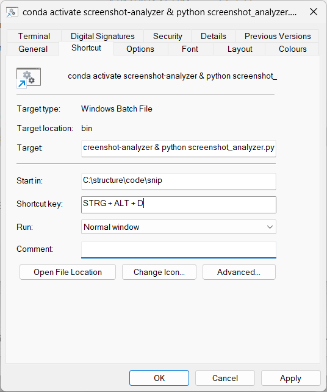

# Screenshot Question Answerer

A Python application that allows you to capture a screenshot of a question and get an answer using Anthropic's large language model (LLM) [Claude](https://claude.ai).

## Note

This is research tool for exploring LLM-assisted user interaces. The screenshots you take using this tool will be sent to the AI Service provider remotely and processed there. Make sure to not submit screenshots of private, personal or secret data.


## Installation

1. Create a new conda environment:
```bash
conda create -n screenshot-question-answerer python=3.10
conda activate screenshot-question-answerer
```

2. Install the required packages:
```bash
pip install pillow pyautogui pyperclip anthropic python-dotenv
```

## Configuration

1. Create a `.env` file in the same directory as the script with your Anthropic API key:
```
ANTHROPIC_API_KEY=your_api_key_here
```

2. Replace `your_api_key_here` with your actual Anthropic API key. You can get one from [Anthropic's Console](https://console.anthropic.com/).

## Usage

1. Run the script:
```bash
python screenshot_analyzer.py
```

2. The screen will darken slightly
3. Click and drag to select the region containing your question
4. Release to capture and analyze
5. Results will appear in a window and be copied to your clipboard
6. Press ESC at any time to cancel

## Setting Up a Windows Keyboard Shortcut

* Create a new Windows shortcut in the folder "%AppData%\Microsoft\Windows\Start Menu\Programs".
* Enter the target "powershell.exe -WindowStyle Hidden -Command "C:\path\to\run_analyzer.bat""
* Enter the location where the .py file is located ("C:\path\to\").
* Enter the desired shortcut, e.g. Ctrl + Alt + A
* Click "OK"

)

Now you can use your keyboard shortcut from anywhere to launch the screenshot analyzer!

## License

This project is open source and available under the BSD-3 License. 

## Acknowledgements

The code was written mostly using [cursor](https://cursor.dev/). Hence, @haesleinhuepf is only partially responsible for the code quality ;-)
